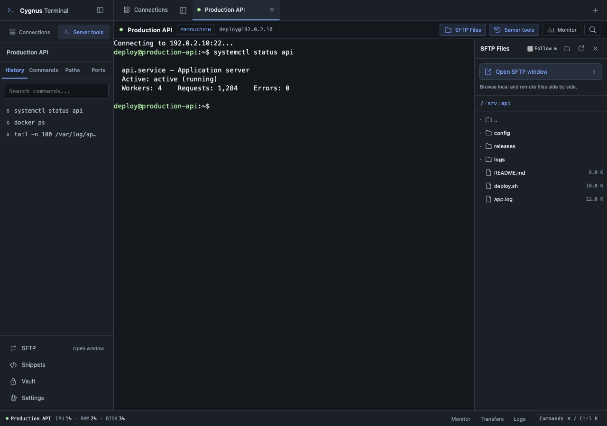
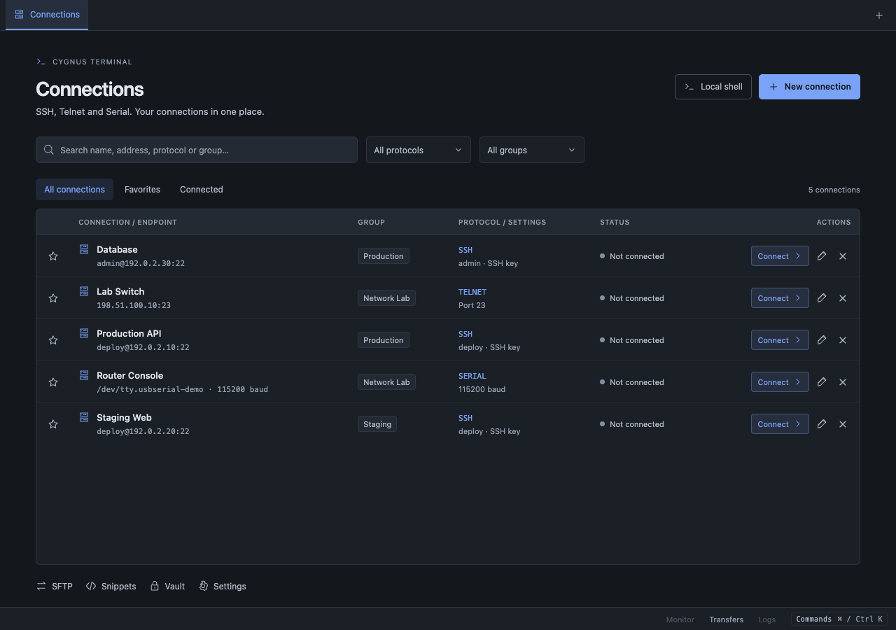
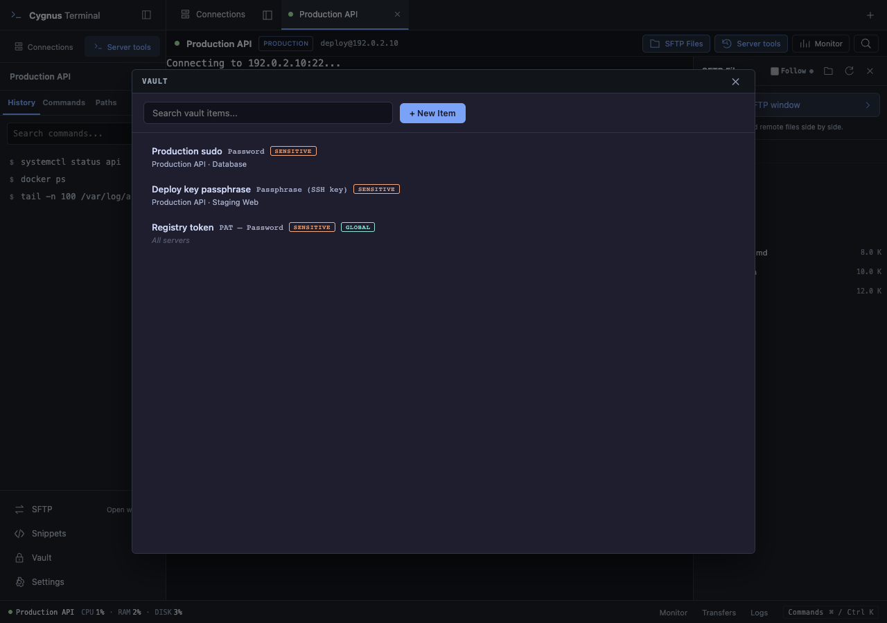
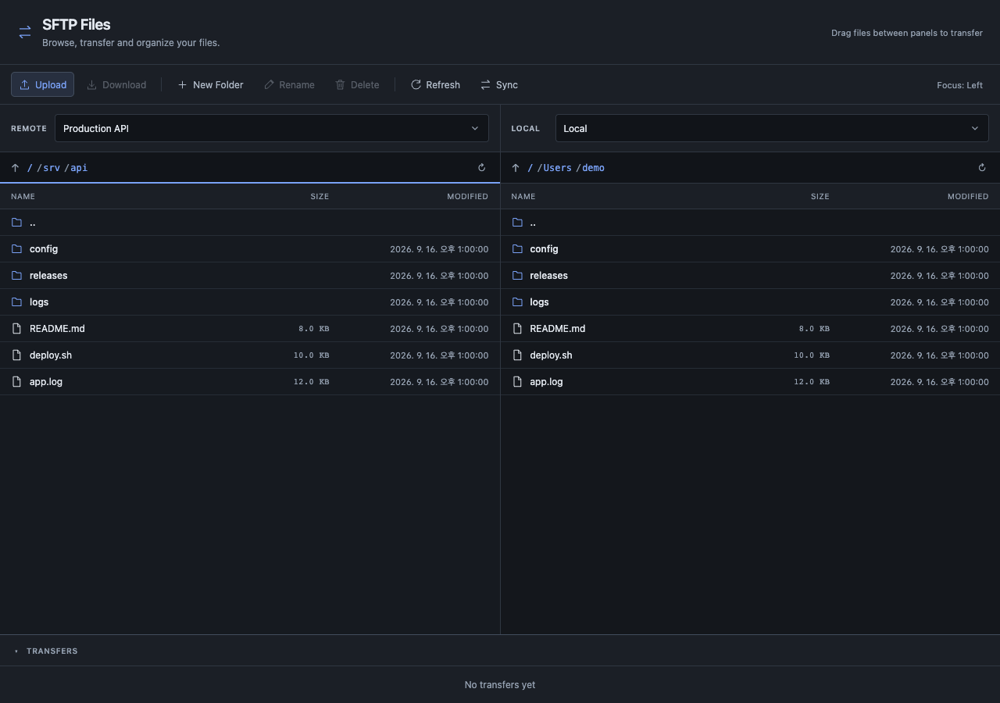

<div align="center">
  
  <h1>Cygnus Terminal</h1>
  <p><strong>서버에 접속하고, 파일을 옮기고, 반복 작업을 기억하는 터미널.</strong></p>
  <p>Rust · Tauri 2 · SSH · Telnet · Serial · SFTP · Credential Vault</p>
  <p><strong>한국어</strong> · <a href="README.en.md">English</a></p>
  <p><a href="https://github.com/cygnus970209/cygnus-terminal/releases/latest">다운로드</a> · <a href="#주요-기능">주요 기능</a> · <a href="#로드맵">로드맵</a> · <a href="CHANGELOG.md">업데이트 내역</a></p>
</div>



Cygnus는 여러 서버와 네트워크 장비를 오가며 작업하는 사람을 위한 데스크톱 터미널입니다. 접속 정보뿐 아니라 서버별 명령 기록, 자주 쓰는 명령, 경로, 자격 증명까지 한곳에서 관리합니다.

**Rust 백엔드와 운영체제의 WebView를 사용하는 Tauri 구조**로, 별도의 Chromium 런타임을 앱에 묶지 않습니다. 메모리 부담을 줄이는 가벼운 구조를 지향합니다. 실제 메모리 사용량은 운영체제·탭 수·작업에 따라 달라지며, 비교 벤치마크 수치를 주장하지 않습니다.

> 화면은 현재 UI에 예시 데이터를 넣어 촬영했습니다. 서버 주소·파일·자격 증명 항목은 데모용입니다.

## 주요 기능

| 필요한 작업 | Cygnus에서 할 수 있는 일 |
| --- | --- |
| 서버·장비 접속 | SSH, Telnet, Serial, 로컬 셸을 하나의 탭 작업 공간에서 사용 |
| 반복 접속 | 프로토콜별 연결 저장, 그룹 선택, 즐겨찾기, 검색·필터 |
| 비밀번호 입력 | 암호화 Vault와 서버별 연결, SSH 프롬프트에서 자격 증명 선택·입력 |
| 파일 관리 | SFTP 전용 창, 로컬·원격 양쪽 패널, 서버 간 전송, 전송 상태 확인 |
| 반복 명령 | SSH 서버별 히스토리, 명령·경로 북마크, 공용 스니펫 |
| 운영 점검 | CPU·메모리·디스크 모니터, 여러 로그 스트림, SSH 로컬 포트 포워딩 |

## 접속부터 정리하는 Connections



- **SSH**: 비밀번호·키 인증, Jump Host, Agent Forwarding, 호스트 키 확인.
- **Telnet**: 레거시 서버와 네트워크 장비 접속.
- **Serial**: COM/TTY 장치 경로와 baud rate 저장. 장비가 꽂혀 있지 않아도 연결 정보를 준비할 수 있습니다.
- **Local Shell**: 필요할 때 탭으로 여는 로컬 터미널.

그룹은 한 번 연결에 저장하면 다음부터 목록에서 선택합니다. 프로토콜·그룹 필터와 즐겨찾기로 원하는 연결을 찾고, **저장**과 **저장 후 연결**을 구분해서 사용할 수 있습니다.

## 자격 증명을 기억하는 Vault



매번 비밀번호를 복사하고 붙여 넣는 대신, 서버에 맞는 자격 증명을 선택하세요.

- 비밀번호, SSH 키 암호, SSH 키, PAT 사용자명·토큰 항목 관리.
- 하나의 항목을 여러 서버에 연결하고 적용 범위 관리.
- SSH의 `sudo`·비밀번호·키 암호 프롬프트 감지와 입력 후보 제공. 감지 패턴은 설정에서 변경할 수 있습니다.
- 로컬 비밀 값은 **AES-256-GCM**으로 암호화하고, 마스터 키는 운영체제 자격 증명 저장소에서 관리합니다.
- **Vault 입력 동작은 Rust 백엔드에서 복호화 후 SSH 채널에 직접 전달**합니다. 이 과정에서 복호화된 비밀번호를 화면으로 반환하거나 클립보드에 복사하지 않습니다.

현재 비밀 값 입력은 Cygnus에 로컬 저장한 항목의 SSH 입력을 지원합니다. 외부 비밀번호 관리자 연동은 현재 제공 기능으로 안내하지 않습니다.

## 파일 작업은 SFTP 전용 창에서



터미널 상단의 **SFTP Files**를 누르면 오른쪽 파일 패널이 열립니다. 패널의 **Open SFTP window** 버튼으로 더 넓은 파일 작업 공간에 바로 진입할 수 있습니다.

- 양쪽 패널에서 로컬 또는 원격 서버 선택, **서버↔서버 전송**.
- 드래그 앤 드롭, 다중 선택, 업로드·다운로드, 이름 변경·폴더 생성.
- 전송 진행률·속도·취소, 파일명 충돌 시 덮어쓰기·건너뛰기·다른 이름 보관.
- 로컬↔원격 폴더 동기화와 실행 전 차이 확인.
- 원격 파일을 로컬 편집기로 열고, 저장한 변경 사항을 자동 업로드.

## 서버마다 이어지는 작업 맥락

저장된 SSH 연결에서는 왼쪽 **Server tools**에 익숙한 작업을 모아 두었습니다.

- **History**: 실행한 명령 검색, 다시 실행, Commands에 저장.
- **Commands**: 자주 쓰는 점검·재시작·배포 명령 북마크.
- **Paths**: 자주 가는 디렉터리 북마크.
- **Ports**: SSH 로컬 포트 포워딩 관리.

공용 **Snippets**, `⌘/Ctrl K` 명령 팔레트, 크기 조절 가능한 패널로 반복 작업을 줄입니다. 자동 경로 추적은 **OSC 7 경로 정보를 보내는 셸에서만** 동작하며, 앱이 `pwd`를 끼워 넣지 않습니다.

서버 모니터와 로그 뷰어는 별도 SSH 채널을 사용합니다. 터미널에서 작업하면서 자원 상태와 여러 로그를 함께 확인할 수 있습니다.

## 설치

[최신 릴리스](https://github.com/cygnus970209/cygnus-terminal/releases/latest)에서 설치 파일을 내려받으세요.

| 플랫폼 | 배포 파일 |
| --- | --- |
| macOS · Apple Silicon | `.dmg` — Developer ID 서명·공증 적용 |
| Windows · x64 | `.msi` 또는 `.exe` — 현재 Windows 코드 서명 미적용 |

설치된 앱은 GitHub Releases를 통해 업데이트를 확인합니다. Linux와 Intel Mac용 설치 파일은 현재 릴리스 대상에 포함되지 않습니다.

연결 프로필과 명령·경로 북마크는 JSON으로 내보내고 가져올 수 있습니다. 이 내보내기는 비밀번호·Vault·스니펫을 포함하는 전체 백업이 아닙니다.

## 로드맵

**다음 방향은 여러 서버를 한 번에 관리하는 운영 자동화입니다.**

Ansible처럼 서버 그룹을 대상으로 명령·설정 변경·배포를 실행하고, 서버별 결과를 확인하는 고급 기능을 계획하고 있습니다. 현재 버전에는 포함되지 않으며 제공 범위와 일정은 추후 안내합니다.

## 개발하기

React·TypeScript·xterm.js 화면과 Rust 백엔드를 Tauri 2로 연결합니다. 데이터는 로컬 SQLite에 저장합니다.

Rust stable, Node.js 22.12+ 또는 Bun, 운영체제별 Tauri 빌드 도구가 필요합니다.

```sh
bun install --frozen-lockfile
bun run tauri dev

# 검증
bun run build
bun run test
cargo test --manifest-path src-tauri/Cargo.toml

# 설치 파일 빌드
bun run tauri build
```

문제 제보와 기능 제안은 [Issues](https://github.com/cygnus970209/cygnus-terminal/issues)로 남겨주세요.

[MIT License](LICENSE)
